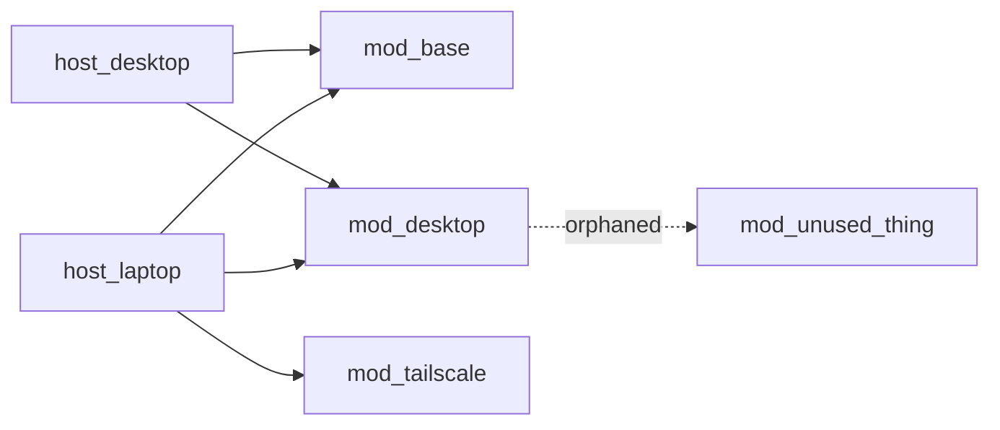

# Nix Dendritic Architecture

Builds a picture of how a dendritic flake's modules actually relate to each other — what each module depends on, which hosts consume which modules, and where the structure has drifted (dead modules, unexpected coupling, cycles). This matters most right before a refactor or migration, when "is this safe to touch" needs a real answer instead of a guess.

## Step 1: Extract the graph

Two layers of dependency exist in a dendritic flake, and both matter:

1. **Module → module**, via genuine option dependencies (module A reads a `config.something` that module B defines) or, less idiomatically, via direct cross-namespace references
2. **Host/profile → module**, i.e. which `flake.modules.*` entries each `nixosConfigurations.<host>` / `homeConfigurations.<name>` / profile actually pulls in

Grep across the tree for `flake.modules.` references (both definitions and reads), `config.flake.modules`, and wherever hosts are assembled, to build both layers. For a large repo, write a small script rather than doing this by eye — reliability matters more than elegance here:

```bash
grep -rn "flake.modules\." --include="*.nix" .
```

Cross-reference definitions (`flake.modules.nixos.foo = ...`) against reads (anything consuming `foo`) to find both ends of each edge.

## Step 2: Analyze the graph

- **Orphaned modules** — defined under `flake.modules.*` but never referenced by any host or profile. Flag these; they may be intentionally unused (WIP, disabled) or genuinely dead.
- **Cycles** — A depends on B which depends on A. In a well-formed dendritic tree this shouldn't happen since modules are meant to be independent concerns merged by flake-parts, not a real dependency chain; a cycle usually indicates a module reaching across namespaces in a way it shouldn't.
- **Unexpected coupling** — a module in one namespace or domain reaching into another far outside what its name would suggest (e.g. a `neovim` module also configuring networking). This is a signal the file is doing more than one concern's worth of work.
- **Hub modules** — modules referenced by nearly every host. Not a problem by itself, but worth surfacing since a change there has wide blast radius — relevant context for "is this safe to change."
- **Duplication across hosts** — two hosts defining very similar config independently instead of sharing a module/profile. This is architecture, not lint — call it out as an opportunity, not a violation.

## Step 3: Present the graph

Default to a Mermaid diagram plus a short written summary — the diagram is for shape, the summary is for what actually matters:



Follow with prose: "3 hosts, 12 modules. `base` and `desktop` are hub modules used everywhere — changes there affect all hosts. `modules/old-vpn.nix` looks orphaned, nothing references it. No cycles found."

## Step 4: Answer "is it safe to change X" directly when asked

Given a specific module, trace: which hosts pull it in (directly or via a profile), and what else in the graph reads anything it defines. State the blast radius plainly ("used by 3 of 4 hosts via the `desktop` profile; nothing else depends on its internals") rather than a vague "it depends."
